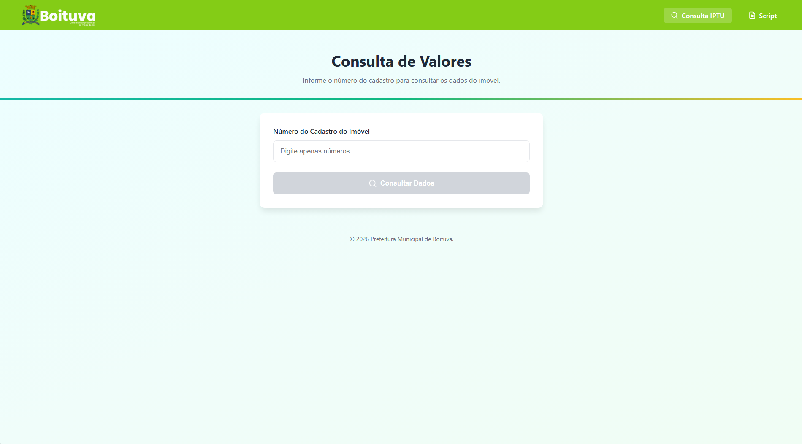
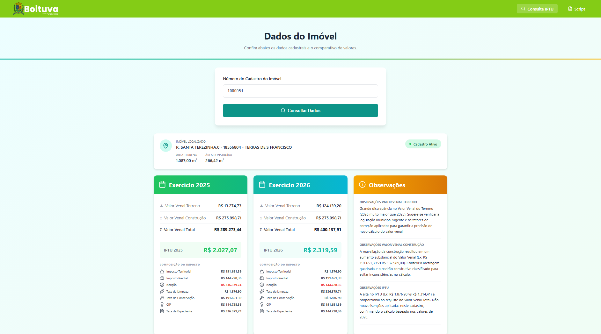
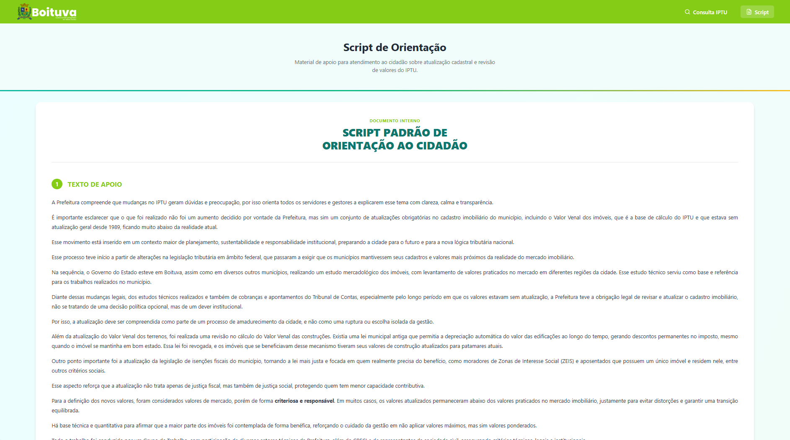
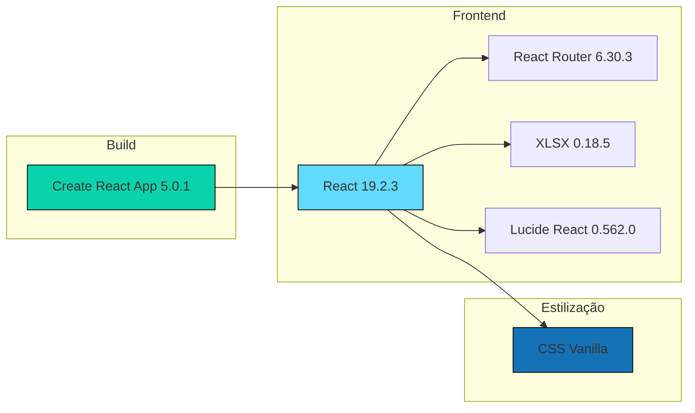
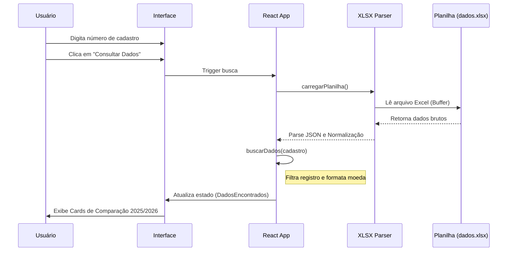
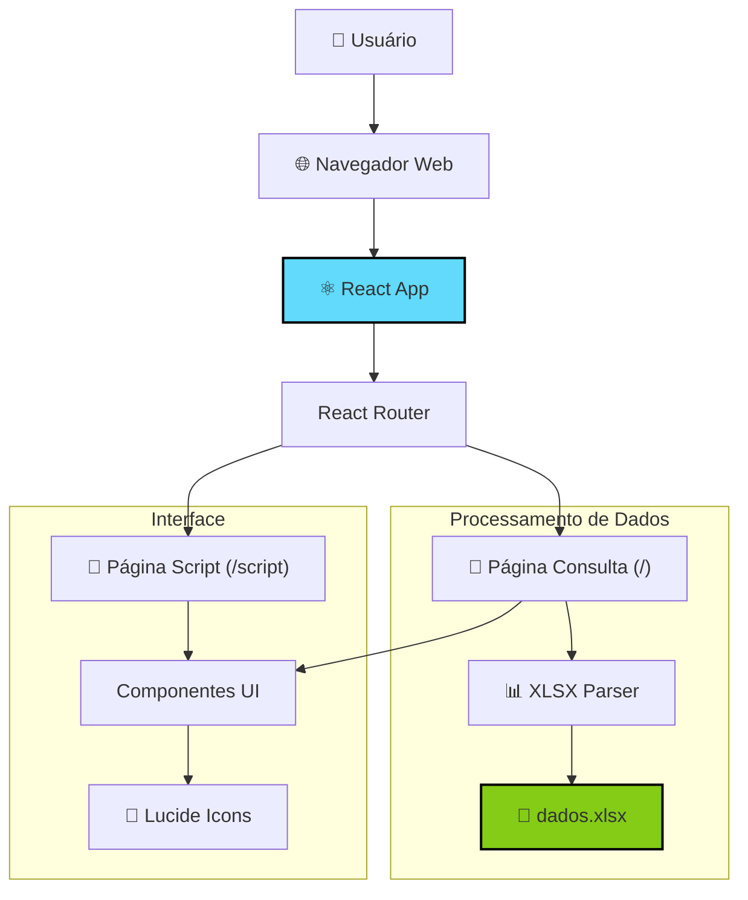

# Site de Consulta de IPTU

## 📋 Sobre o projeto
Este projeto é uma aplicação web desenvolvida para facilitar a consulta de dados de IPTU pelos cidadãos. Ele permite que o usuário informe o número de cadastro do imóvel e visualize instantaneamente os dados cadastrais, áreas do terreno e construção, além de um comparativo detalhado de valores e composição do imposto por exercício (2025 vs 2026).

A aplicação foi projetada para ser intuitiva, moderna e responsiva, servindo também como ferramenta de apoio para servidores municipais através de roteiros de atendimento padronizados.

## ✨ Funcionalidades

- **Consulta de Imóveis**: Busca rápida de dados cadastrais pelo número do cadastro.
- **Detalhamento de Áreas**: Visualização clara das áreas de terreno e construção.
- **Comparativo Anual**: Tabela lado a lado comparando os valores venais e impostos de 2025 e 2026.
- **Composição do Imposto**: Breakdown detalhado de taxas (Limpeza, Conservação, CIP, etc.) e isenções.
- **Observações Administrativas**: Exibição de notas explicativas sobre alterações nos valores.
- **Roteiro de Atendimento**: Página dedicada com scripts e orientações para atendimento ao cidadão.

## 🖼️ Screenshots

### Página de Consulta
A tela inicial oferece uma interface limpa para inserção do cadastro do imóvel.



### Resultado da Consulta
Após a busca, os dados são apresentados em cards organizados, facilitando a comparação entre exercícios.



### Página de Roteiro (Script)
Documentação interna para padronizar o atendimento e esclarecer dúvidas frequentes.



## 🏗️ Arquitetura e Design

O projeto segue uma arquitetura baseada em componentes React, processando dados inteiramente no *client-side* a partir de planilhas Excel, garantindo facilidade de atualização e implantação.

### Stack Tecnológico



### Fluxo de Consulta

O fluxo de dados é otimizado para leitura local de arquivos XLSX, evitando a necessidade de um backend complexo para este caso de uso.



### Arquitetura Geral



## 🛠️ Tecnologias utilizadas

- **React** (v19.2.3): Biblioteca principal para construção da interface.
- **Create React App**: Ferramenta de build e configuração inicial.
- **React Router** (v6.30.3): Gerenciamento de rotas e navegação.
- **XLSX** (v0.18.5): Leitura e manipulação de planilhas Excel diretamente no navegador.
- **Lucide React** (v0.562.0): Biblioteca de ícones moderna e leve.
- **CSS3**: Estilização customizada com uso de Flexbox, Grid e Variáveis CSS.

## 🚀 Como executar

1. **Clone o repositório**
   ```bash
   git clone https://github.com/joaoSilva240/Site-de-Consulta-de-IPTU.git
   cd Site-de-Consulta-de-IPTU
   ```

2. **Instale as dependências**
   ```bash
   npm install
   ```

3. **Inicie o servidor de desenvolvimento**
   ```bash
   npm start
   ```
   A aplicação abrirá automaticamente em `http://localhost:3000`.

## 📁 Estrutura do projeto

```
Site-de-Consulta-de-IPTU/
├── docs/               # Documentação e screenshots
├── public/             # Arquivos estáticos (index.html, dados.xlsx, logos)
├── src/
│   ├── components/     # Componentes reutilizáveis (Navbar, etc.)
│   ├── pages/          # Páginas principais (Consulta.js, Script.js)
│   ├── App.js          # Configuração de rotas principal
│   ├── App.css         # Estilos globais
│   └── index.js        # Ponto de entrada da aplicação
└── package.json        # Dependências e scripts
```

## 📄 Licença

Este projeto é de uso interno/privado para fins de consulta municipal.
